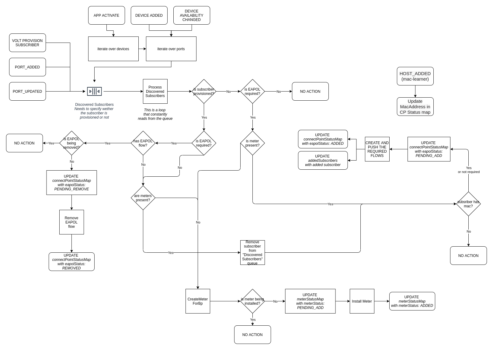

# org.opencord.org

This ONOS applications is responsible to configure the flows
required to manage an OLT Device as reported by VOLTHA.

## Configuration

The `org.opencord.olt` application depends on `org.opencord.sadis` and exposes 
the following configuration:

```shell
karaf@root > cfg get org.opencord.olt.impl.Olt
org.opencord.olt.impl.Olt
    name=defaultBpId, type=string, value=Default, defaultValue=Default, description=Default bandwidth profile id that is used for authentication trap flows.
    name=flowProcessingThreads, type=integer, value=8, defaultValue=8, description=Number of threads used to process flows.
    name=multicastServiceName, type=string, value=MC, defaultValue=MC, description=Default multicast service name.
    name=requeueDelay, type=integer, value=500, defaultValue=500, description=Delay in ms to put an event back in the queue, used to avoid retrying things to often if conditions are not met.
    name=subscriberProcessingThreads, type=integer, value=8, defaultValue=8, description=Number of threads used to process flows.

karaf@root > cfg get org.opencord.olt.impl.OltFlowService
org.opencord.olt.impl.OltFlowService
    name=enableDhcpOnNni, type=boolean, value=true, defaultValue=false, description=Create DHCP trap flow on NNI port(s).
    name=enablePppoe, type=boolean, value=false, defaultValue=false, description=Send PPPoED authentication trap flows before subscriber provisioning.
    name=defaultTechProfileId, type=integer, value=64, defaultValue=64, description=Default technology profile id that is used for authentication trap flows.
    name=enableIgmpOnNni, type=boolean, value=false, defaultValue=false, description=Create IGMP trap flow on NNI port(s).
    name=enableEapol, type=boolean, value=true, defaultValue=true, description=Send EAPOL authentication trap flows before subscriber provisioning.
    name=enableDhcpV6, type=boolean, value=false, defaultValue=false, description=Enable flows for DHCP v6 if dhcp is required in sadis config.
    name=enableDhcpV4, type=boolean, value=true, defaultValue=true, description=Enable flows for DHCP v4 if dhcp is required in sadis config.
    
karaf@root > cfg get org.opencord.olt.impl.OltMeterService
org.opencord.olt.impl.OltMeterService
    name=deleteMeters, type=boolean, value=true, defaultValue=true, description=Delete meters when reference count drops to zero.


```

## CLI commands

```text
volt-add-subscriber-access                                                           (Adds a subscriber to an access device)
volt-bpmeter-mappings         (Shows information about programmed meters, including the relation with the Bandwidth Profile)
volt-failed-subscribers                                                         (Shows subscribers that failed provisioning)
volt-olts                                                                                    (Shows vOLTs connected to ONOS)
volt-port-status                                    (Shows information about the OLT ports (default EAPOL, subscriber flows)
volt-programmed-meters        (Shows information about programmed meters, including the relation with the Bandwidth Profile)
volt-programmed-subscribers                                                  (Shows subscribers programmed in the dataplane)
volt-remove-subscriber-access                                                        (Adds a subscriber to an access device)
volt-requested-subscribers (Shows subscribers programmed by the operator. Their data-plane status depends on the ONU status)

```

## REST API

The programmed subscribers information is available through REST API.

The list of programmed subscribers can be found in the endpoint "/onos/olt/oltapp/programmed-subscribers", e.g:
```sh
curl 'http://localhost:8181/onos/olt/oltapp/programmed-subscribers'
```

There are filters by device-id and connect point (device-id and port), e.g:
```sh
curl 'http://localhost:8181/onos/olt/oltapp/programmed-subscribers/of%3A00000a0a0a0a0a0a'
curl 'http://localhost:8181/onos/olt/oltapp/programmed-subscribers/of%3A00000a0a0a0a0a0a/257'
```

These commands will generate a JSON output with a list of programmed subscribers, e.g:
```sh
{
  "entries": [
    {
      "location": "of:00000a0a0a0a0a0a/257",
      "tagInfo": {
        "uniTagMatch": 0,
        "ponCTag": 900,
        "ponSTag": 900,
        "usPonCTagPriority": -1,
        "usPonSTagPriority": -1,
        "dsPonCTagPriority": -1,
        "dsPonSTagPriority": -1,
        "technologyProfileId": 64,
        "upstreamBandwidthProfile": "Default",
        "downstreamBandwidthProfile": "Default",
        "upstreamOltBandwidthProfile": "Default",
        "downstreamOltBandwidthProfile": "Default",
        "serviceName": "hsia",
        "enableMacLearning": false,
        "configuredMacAddress": "A4:23:05:00:00:00",
        "isDhcpRequired": true,
        "isIgmpRequired": false,
        "isPppoeRequired": false
      }
    }
  ]
}
```

## App Design

The `org.opencord.olt` application internal structure reflects the following diagram:



## Install the app on a running ONOS

> _**Prerequisites**_
> 
> - A running ONOS cluster (can be a single node cluster)
> - ONOS REST APIs exposed out of the kubernetes cluster and reachable from your machine (we used port 30120 in the following example)


If you want to try out the app on a running ONOS cluster you can follow this procedure: 

1) Build the app (requires Java 11 to be installed)
    ```shell
    mvn clean install
    ```
2) Uninstall the current version of the app:
    ```shell
    curl --fail -sSL --user karaf:karaf --noproxy 127.0.0.1  -X DELETE http://127.0.0.1:30120/onos/v1/applications/org.opencord.olt
    ```
   You should see the following confirmation message in the logs:
    ```shell
    17:15:39.279 INFO  [ApplicationManager] Application org.opencord.olt has been uninstalled
    ```
3) Install the new version of the app
    ```shell
    curl --fail -sSL --user karaf:karaf --noproxy 127.0.0.1  -X POST -HContent-Type:application/octet-stream http://127.0.0.1:30120/onos/v1/applications?activate=true --data-binary @app/target/olt-app-5.0.0.oar
    ```
   you should see:
    ```shell
    17:55:37.197 INFO  [ApplicationManager] Application org.opencord.olt has been activated
    ```